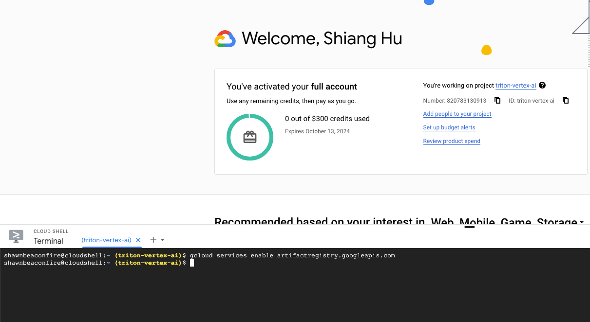
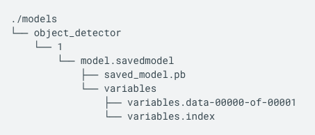
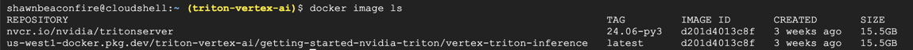
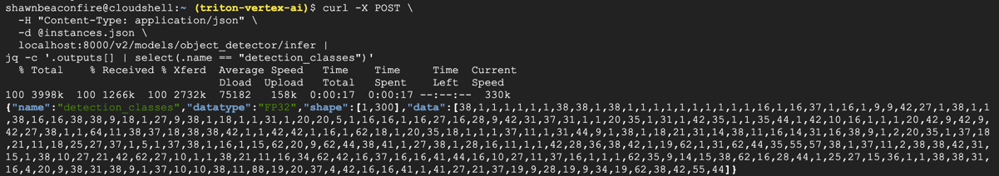
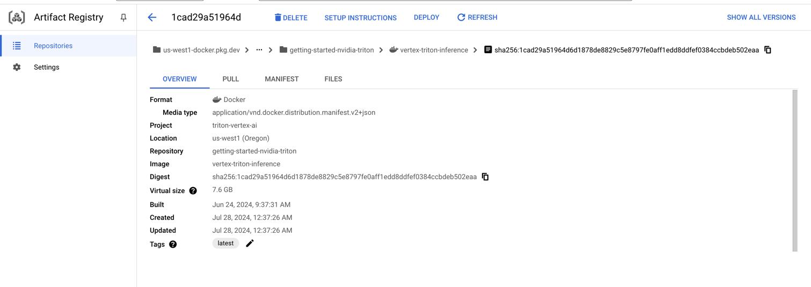
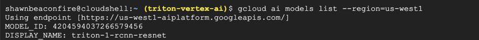
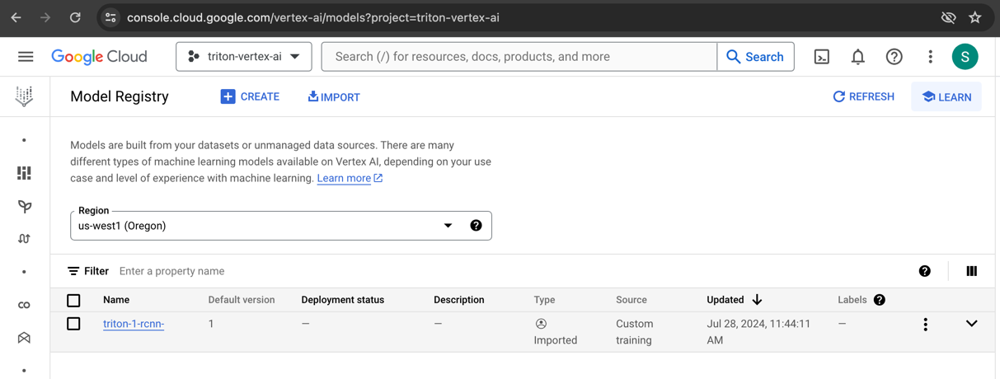
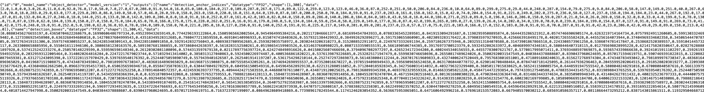
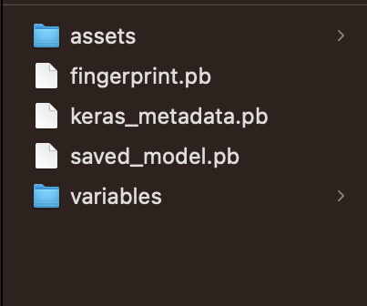
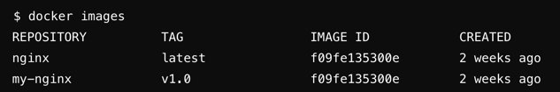

## Summary
[Google Doc Tutorial - Vertex AI - Serve predictions with NVIDIA Triton](https://cloud.google.com/vertex-ai/docs/predictions/using-nvidia-triton)

IMAGE: high-level architecture of Triton on Vertex AI Prediction <br>


## Step
#### 1. Create a gcloud project
Create project on [Manage resources](https://console.cloud.google.com/cloud-resource-manager?walkthrough_id=resource-manager--create-project&start_index=1&_ga=2.211645021.9573787.1720992990-1037658882.1720849440#step_index=1)

#### 2. Enable the Vertex AI API and Artifact Registry API APIs.
[Enable APIs](https://console.cloud.google.com/apis/enableflow?apiid=ml.googleapis.com,artifactregistry.googleapis.com&_ga=2.31196287.1749859830.1720995636-120860037.1720995118&project=triton-vertex-ai)

#### 3. Activate Google Cloud console
[Activate Cloud Shell](https://console.cloud.google.com/welcome/new?cloudshell=true&project=triton-vertex-ai)
command-line shell environment with Google Cloud CLI installed and values set for current project



#### 4. Download tensorflow model
- Organize directory to fit Triton requirements
- [Faster R-CNN with Resnet-101 (v1) initialized from Imagenet classification checkpoint. Trained on COCO 2017 dataset (images scaled to 640x640 resolution)]()

```angular2html
mkdir -p models/object_detector/1/model.savedmodel/
curl -L "https://tfhub.dev/tensorflow/faster_rcnn/resnet101_v1_640x640/1?tf-hub-format=compressed" | \
    tar -zxvC ./models/object_detector/1/model.savedmodel/
ls -ltr ./models/object_detector/1/model.savedmodel/
```

->
<br>



#### 5. Create gs bucket as MODEL_ARTIFACTS_REPOSITORY
Create gs bucket as a model artifacts repository to be used for Vertex AI model resource
```angular2html
gsutil cp -r ./models/object_detector gs://triton-model-artifacts/
```
-> [bucket](https://console.cloud.google.com/storage)

#### 6. Create an Artifact Registry repository to store custom Triton container image
```angular2html
# Enable the Artifact Registry API service for your project.
gcloud services enable artifactregistry.googleapis.com
```

Create artifact repository 
<br>
- Specify location [where Vertex AI has a regional endpoint](https://cloud.google.com/vertex-ai/docs/general/locations#feature-availability)
- LOCATION = Google Cloud region where your Artifact Registry is hosted <br>
`ex: us-west1`

```angular2html
LOCATION=us-west1

gcloud artifacts repositories create getting-started-nvidia-triton \
 --repository-format=docker \
 --location=$LOCATION \
 --description="NVIDIA Triton Docker repository"
```
-> [Artifact Registry](https://console.cloud.google.com/artifacts)

#### 7. Build container image
- NVIDIA provides [Triton Docker images](https://catalog.ngc.nvidia.com/orgs/nvidia/containers/tritonserver/tags) and aligns with Vertex AI custom container requirements for serving
- Docker image tag convention `LOCATION-docker.pkg.dev/PROJECT_ID/MY_ARTIFACTORY_REPO/CUSTOM_DOCKER_IMAGE_NAME`
```angular2html
NGC_TRITON_IMAGE_URI=nvcr.io/nvidia/tritonserver:24.06-py3
docker pull $NGC_TRITON_IMAGE_URI
docker tag $NGC_TRITON_IMAGE_URI us-west1-docker.pkg.dev/triton-vertex-ai/getting-started-nvidia-triton/vertex-triton-inference
```
-> 


#### 8. Generate Triton request json
- Install python packages
```angular2html
requests
pillow
numpy
```
- Run generate-input-json.py to produce instances.json
- Upload instances.json to `gs://triton-input/` bucket

#### 9. Test container locally
```angular2html
docker run -t -d -p 8000:8000 --rm \
  --name=local_object_detector \
  -e AIP_MODE=True \
  $DOCKER_TAG \
  --model-repository $MODEL_ARTIFACTS_REPOSITORY \
  --strict-model-config=false
->
docker run -t -d -p 8000:8000 --rm \
  --name=local_object_detector \
  -e AIP_MODE=True \
  us-west1-docker.pkg.dev/triton-vertex-ai/getting-started-nvidia-triton/vertex-triton-inference \
  --model-repository gs://triton-model-artifacts \
  --strict-model-config=false
```

-> Check health, should receive 200 status code
```angular2html
curl -s -o /dev/null -w "%{http_code}" http://localhost:8000/v2/health/ready
```

-> Check model response
```angular2html
# Copy bucket file to shell since curl doesn't recognize bucket path
gsutil cp gs://triton-input/instances.json instances.json

curl -X POST \
  -H "Content-Type: application/json" \
  -d @instances.json \
  localhost:8000/v2/models/object_detector/infer |
jq -c '.outputs[] | select(.name == "detection_classes")'
```
-> Should return prediction `{"name":"detection_classes","datatype":"FP32","shape":[1,300],"data":[38,1,...,44]}`
<br>



```angular2html
docker container stop $CONTAINER_ID
```

#### 10. Push the container image to Artifact Registry
[Store Docker container images in Artifact Registry](https://cloud.google.com/artifact-registry/docs/docker/store-docker-container-images#auth)
- Run command to give your local Docker installation permission to push to Artifact Registry in your chosen region
- `docker.pkg.dev` part is fixed and denotes the domain used by Google Cloud's Artifact Registry for Docker repositories
- The command updates your Docker configuration. You can now connect with Artifact Registry in your Google Cloud project to push and pull images.
```angular2html
gcloud auth configure-docker ${LOCATION}-docker.pkg.dev
->
gcloud auth configure-docker us-west1-docker.pkg.dev
```

- Run command to push the created container image to Artifact Registry
```angular2html
docker push IMAGE_TAG
->
docker push us-west1-docker.pkg.dev/triton-vertex-ai/getting-started-nvidia-triton/vertex-triton-inference
```
->


#### 11. gcloud ai models upload
- [gcloud ai models upload](https://cloud.google.com/sdk/gcloud/reference/ai/models/upload)
- `container-image-uri`: URI of the Docker image in the Container Registry
- `artifact-uri`: Google Cloud Storage URI where the model artifacts are stored
- `container-args='--strict-model-config=false'`: allows Triton to generate the model configuration automatically.

```angular2html
DEPLOYED_MODEL_NAME=triton-1-rcnn-resnet

gcloud ai models upload \
  --region=$LOCATION \
  --display-name=$DEPLOYED_MODEL_NAME \
  --container-image-uri=LOCATION-docker.pkg.dev/PROJECT_ID/getting-started-nvidia-triton/vertex-triton-inference \
  --artifact-uri=MODEL_ARTIFACTS_REPOSITORY \
  --container-args='--strict-model-config=false'

->
gcloud ai models upload \
  --region=us-west1 \
  --display-name=triton-1-rcnn-resnet \
  --container-image-uri=us-west1-docker.pkg.dev/triton-vertex-ai/getting-started-nvidia-triton/vertex-triton-inference \
  --artifact-uri=gs://triton-model-artifacts \
  --container-args='--strict-model-config=false'
```
-> List Models
```angular2html
gcloud ai models list --region=LOCATION
gcloud ai models describe MODEL_ID --region=YOUR_REGION
->
gcloud ai models list --region=us-west1
gcloud ai models describe 4204594037266579456 --region=us-west1
```
->


->
[vertex-ai - Model Registry](https://console.cloud.google.com/vertex-ai/models?project=triton-vertex-ai)


#### 12. Create a new Vertex AI endpoint
```angular2html
ENDPOINT_NAME=image_classify

gcloud ai endpoints create \
  --region=$LOCATION \
  --display-name=$ENDPOINT_NAME
->
gcloud ai endpoints create \
    --region=us-west1 \
    --display-name=image_classify

gcloud ai endpoints list --region=$LOCATION
```

#### 13. Deploy model to endpoint
- [Deploy a model to an endpoint](https://cloud.google.com/sdk/gcloud/reference/ai/endpoints/deploy-model), the service associates physical resources with the model running Triton to serve online predictions.
- machine-type: Virtual machine resource for each node
- accelerator type: GPU accelerator ex: nvidia-tesla-p100, nvidia-tesla-v100...
- traffic-split: [DEPLOYED_MODEL_ID=VALUE,…], List of pairs of deployed model id and value to set as traffic split.

```angular2html
ENDPOINT_ID=$(gcloud ai endpoints list \
    --region=$LOCATION \
    --filter=display_name=$ENDPOINT_NAME \
    --format="value(name)")

MODEL_ID=$(gcloud ai models list \
    --region=$LOCATION \
    --filter=display_name=$DEPLOYED_MODEL_NAME \
    --format="value(name)")

gcloud ai endpoints deploy-model $ENDPOINT_ID \
    --region=$LOCATION \
    --model=$MODEL_ID \
    --display-name=$DEPLOYED_MODEL_NAME \
    --machine-type=MACHINE_TYPE \
    --min-replica-count=MIN_REPLICA_COUNT \
    --max-replica-count=MAX_REPLICA_COUNT \
    --accelerator=count=ACCELERATOR_COUNT,type=ACCELERATOR_TYPE \
    --traffic-split=0=100

gcloud ai endpoints raw-predict $ENDPOINT_ID \
    --region=$LOCATION \
    --http-headers=Content-Type=application/json \
    --request=@instances.json
->

gcloud ai endpoints deploy-model $ENDPOINT_ID \
    --region=$LOCATION \
    --model=$MODEL_ID \
    --display-name=$DEPLOYED_MODEL_NAME \
    --machine-type=n1-standard-2 \
    --min-replica-count=1 \
    --max-replica-count=1 \
    --accelerator=count=1,type=nvidia-tesla-t4 \
    --traffic-split=0=100

gcloud ai endpoints describe $ENDPOINT_ID --region=$LOCATION

curl -X POST \
-H "Authorization: Bearer $(gcloud auth print-access-token)" \
-H "Content-Type: application/json" \
"https://us-west1-aiplatform.googleapis.com/v1/projects/triton-vertex-ai/locations/us-west1/endpoints/${ENDPOINT_ID}:rawPredict" \
-d "@test_instances.json" \
-o myresponse.json
```
->


#### 14. Cleanup
```angular2html
DEPLOYED_MODEL_ID=$(gcloud ai endpoints describe $ENDPOINT_ID \
    --region=$LOCATION \
    --format="value(deployedModels.id)")

# Undeploy model from endpoint 
gcloud ai endpoints undeploy-model $ENDPOINT_ID \
    --region=$LOCATION \
    --deployed-model-id=$DEPLOYED_MODEL_ID

# Delete the endpoint,
gcloud ai endpoints delete $ENDPOINT_ID \
    --region=$LOCATION \
    --quiet

# Delete model
gcloud ai models delete $MODEL_ID \
    --region=$LOCATION \
    --quiet

# Delete your Artifact Registry repository and the container image in it
gcloud artifacts repositories delete getting-started-nvidia-triton \
  --location=$LOCATION \
  --quiet
```

## Knowledge
(a) The SavedModel format is a standard format for storing and sharing machine learning models that have been trained using TensorFlow
https://www.geeksforgeeks.org/using-the-savedmodel-format-in-tensorflow/

```angular2html
ex:
def build_model(): 
    inputs = tf.keras.Input(shape=(2,), name='inputs') 
    x = tf.keras.layers.Dense(4, activation='relu', name='dense1')(inputs) 
    outputs = tf.keras.layers.Dense(1, name='outputs')(x) 
    model = tf.keras.Model(inputs=inputs, outputs=outputs) 
    return mode

model = build_model() 
model.save('saved_model')
```
-> Generates directory named `saved_model` with contents
<br>
- saved_model.pb: TensorFlow graph in protobuf
- variables.data: weights & biases
- variables.index: index file to retrieve variables in .data efficiently
<br>



```angular2html
loaded_model = tf.saved_model.load('saved_model')
test_input = tf.constant([[0.5, 0.5], [0.2, 0.2]]) 
  
# call the model on the test data 
# use the ‘serving_default’ key to retrieve the default prediction function
result = loaded_model.signatures['serving_default'](inputs=test_input) 
```

(b) docker tag
```angular2html
docker tag nginx:latest my-nginx:v1.0
```
-> 
<br>


## Debug
(a) [Vertex ai payload limit bug](https://issuetracker.google.com/issues/123314535?pli=1)
Payload limit when hitting Vertex endpoint
```angular2html
The request size (2798557 bytes) exceeds 1.500MB limit.
```
-> Minify the json
[JSON Minifier](https://www.site24x7.com/tools/json-minifier.html)